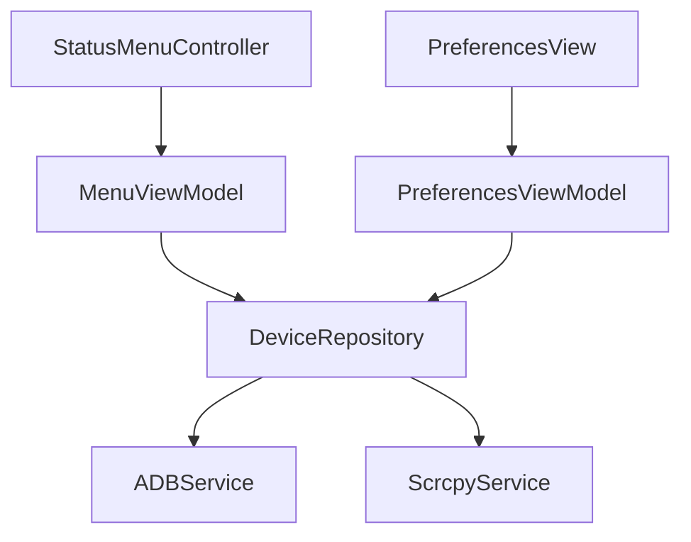

```markdown
# AndroLaunch - Android Device Management Suite 🚀


A professional macOS menu bar application for managing Android devices through ADB and Scrcpy, built with modern Swift architecture patterns.

## Features ✨
- **Device Management**:
  - List connected Android devices
  - Refresh device list in real-time
  - Display device status (connected/unauthorized)
- **App Management**:
  - List installed apps per device
  - Launch apps directly from menu
  - Refresh app list dynamically
- **Device Mirroring**:
  - Full device screen mirroring via Scrcpy
  - Launch apps in dedicated windows
  - Custom display resolutions
- **ADB Management**:
  - Automatic ADB path discovery
  - Daemon management
  - Error handling and recovery
- **Preferences**:
  - ADB status monitoring
  - Error display and recovery guidance

## Architecture 🏛️


### Core Principles
- **Clean Architecture** with strict layer separation
- **MVVM** pattern for UI management
- **Reactive Programming** with Combine
- **Protocol-Oriented** design
- **Dependency Injection** through centralized container

### Layer Structure
| Layer | Components | Responsibility |
|-------|------------|-----------------|
| **Presentation** | `StatusMenuController`, `PreferencesView` | UI rendering, user interactions |
| **Domain** | `AndroidDevice`, `AndroidApp`, Protocols | Business logic, data models |
| **Data** | `ADBService`, `ScrcpyService`, `DeviceRepository` | Service implementations, data access |
| **Core** | `DependencyContainer`, `AppConstants` | DI, configuration, utilities |

## Key Components 🔑

### Service Layer
| Service | Protocol | Implementation | Description |
|---------|----------|-----------------|-------------|
| ADB Manager | `ADBServiceProtocol` | `ADBService` | Handles all ADB operations and device communication |
| Scrcpy Controller | `ScrcpyServiceProtocol` | `ScrcpyService` | Manages device mirroring and app launching |

### Repository Pattern
```swift
protocol DeviceRepositoryProtocol {
    func refreshDevices()
    func fetchApps(for deviceID: String)
    func launchApp(packageID: String, deviceID: String)
    func mirrorDevice(deviceID: String)
}
```

### ViewModel Structure


## Data Flow 🔄
1. **User Action** (e.g., Refresh Devices)
2. **ViewModel** receives action
3. **Repository** coordinates services
4. **Service** executes platform-specific operations
5. **Combine Publishers** propagate changes back
6. **UI** updates automatically

## Development Setup 🛠️

### Requirements
- Xcode 14+
- macOS 12+
- [Homebrew](https://brew.sh/)

### Installation
```bash
# Install dependencies
brew install android-platform-tools scrcpy

# Clone repository
git clone https://github.com/senpai/AndroLaunch.git
cd AndroLaunch

# Open in Xcode
xed .
```

### Configuration
1. Enable **USB Debugging** on Android devices
2. Grant security permissions in macOS Settings
3. Configure signing team in Xcode project

## Code Quality Standards ✅
- 100% Protocol-Oriented design
- Combine for all state management
- Strict access control (`private`, `internal`)
- Comprehensive error handling
- Reactive UI updates
- Documented public interfaces

## Future Roadmap 🗺️
- [ ] Device groups management
- [ ] Custom ADB command support
- [ ] App favoriting system
- [ ] Wireless debugging support
- [ ] Plugin system architecture

## Contributing 🤝
1. Fork the repository
2. Create feature branch (`git checkout -b feature/amazing-feature`)
3. Commit changes
4. Push to branch
5. Open Pull Request

## License 📄
This project is licensed under the MIT License.

---

**Powered By**:
[](https://github.com/Genymobile/scrcpy)
