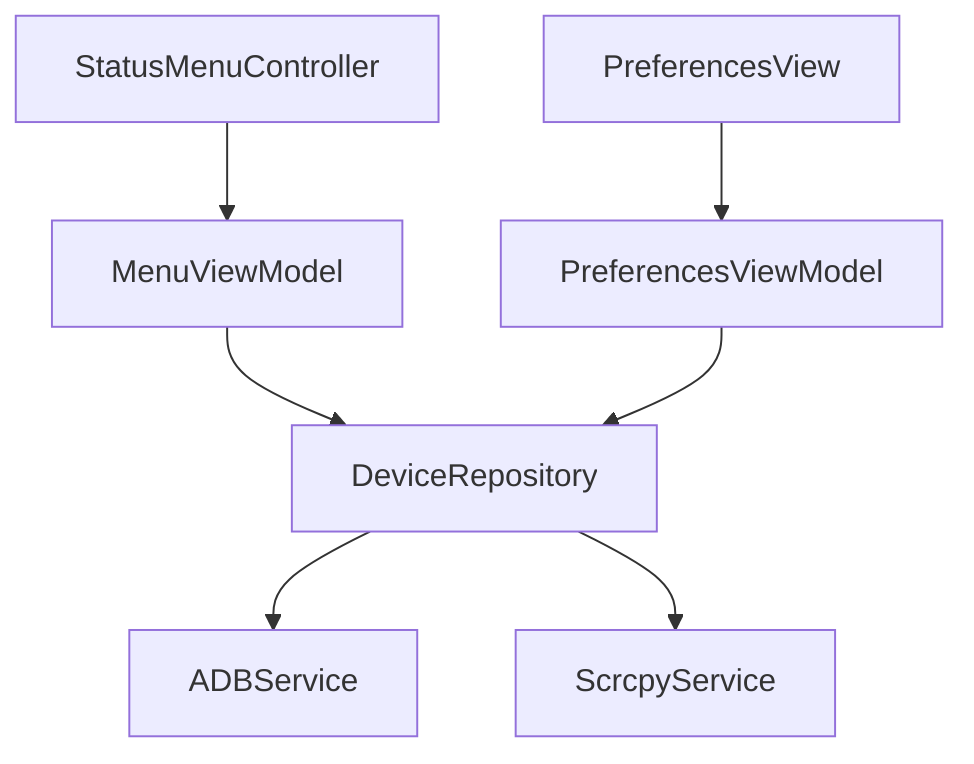

# AndroLaunch - Android Device Management Suite 🚀


A professional macOS menu bar application for managing Android devices through ADB and Scrcpy, built with modern Swift architecture patterns.

## Features ✨
- **Device Management**:
  - List connected Android devices
  - Refresh device list in real-time
  - Display device status (connected/unauthorized)
- **App Management**:
  - List installed apps per device
  - Launch apps directly from menu
  - Refresh app list dynamically
- **Device Mirroring**:
  - Full device screen mirroring via Scrcpy
  - Launch apps in dedicated windows
  - Custom display resolutions
- **ADB Management**:
  - Automatic ADB path discovery
  - Daemon management
  - Error handling and recovery
- **Preferences**:
  - ADB status monitoring
  - Error display and recovery guidance

## Architecture 🏛️

The project follows Clean Architecture principles with the following layers:

### Core Layer
- **Services**: Core services like ADB service, device management
- **DI**: Dependency injection container
- **Constants**: App-wide constants and configurations

### Data Layer
- **Repositories**: Implementation of repository interfaces
- **Parsers**: Data parsing and transformation
- **Services**: Data-related services

### Domain Layer
- **Models**: Business models and entities
- **UseCases**: Business logic and use cases
- **Repositories**: Repository interfaces

### Presentation Layer
- **MenuBar**: Menu bar UI components
- **Preferences**: Settings and preferences UI

## Key Components 🔑

### Service Layer
| Service | Protocol | Implementation | Description |
|---------|----------|-----------------|-------------|
| ADB Manager | `ADBServiceProtocol` | `ADBService` | Handles all ADB operations and device communication |
| Scrcpy Controller | `ScrcpyServiceProtocol` | `ScrcpyService` | Manages device mirroring and app launching |

### Repository Pattern
```swift
protocol DeviceRepositoryProtocol {
    func refreshDevices()
    func fetchApps(for deviceID: String)
    func launchApp(packageID: String, deviceID: String)
    func mirrorDevice(deviceID: String)
}
```

### ViewModel Structure


## Data Flow 🔄
1. **User Action** (e.g., Refresh Devices)
2. **ViewModel** receives action
3. **Repository** coordinates services
4. **Service** executes platform-specific operations
5. **Combine Publishers** propagate changes back
6. **UI** updates automatically

## Setup

1. Clone the repository
2. Install dependencies:
   ```bash
   brew install android-platform-tools
   ```
3. Open `AndroLaunch.xcodeproj` in Xcode
4. Build and run the project

## Development

### Prerequisites
- Xcode 15.0+
- macOS 13.0+
- Android SDK
- ADB (Android Debug Bridge)

### Building
1. Open the project in Xcode
2. Select your target device
3. Build and run (⌘R)

### Testing
- Unit tests are located in the `Tests` directory
- UI tests are located in the `UITests` directory

## Contributing 🤝
1. Fork the repository
2. Create feature branch (`git checkout -b feature/amazing-feature`)
3. Commit changes
4. Push to branch
5. Open Pull Request

## License 📄
This project is licensed under the MIT License.

---

**Powered By**:
[](https://github.com/Genymobile/scrcpy)
